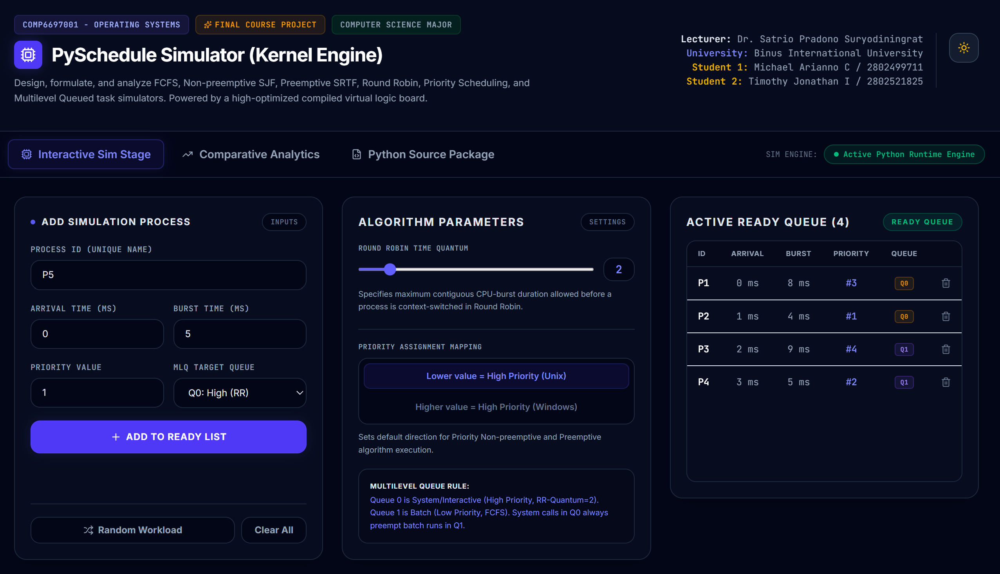
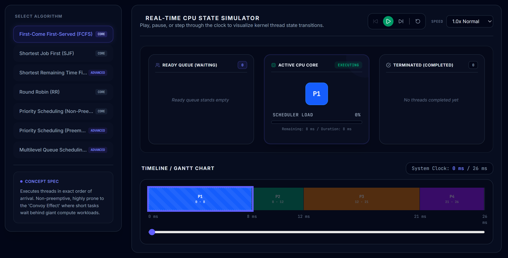
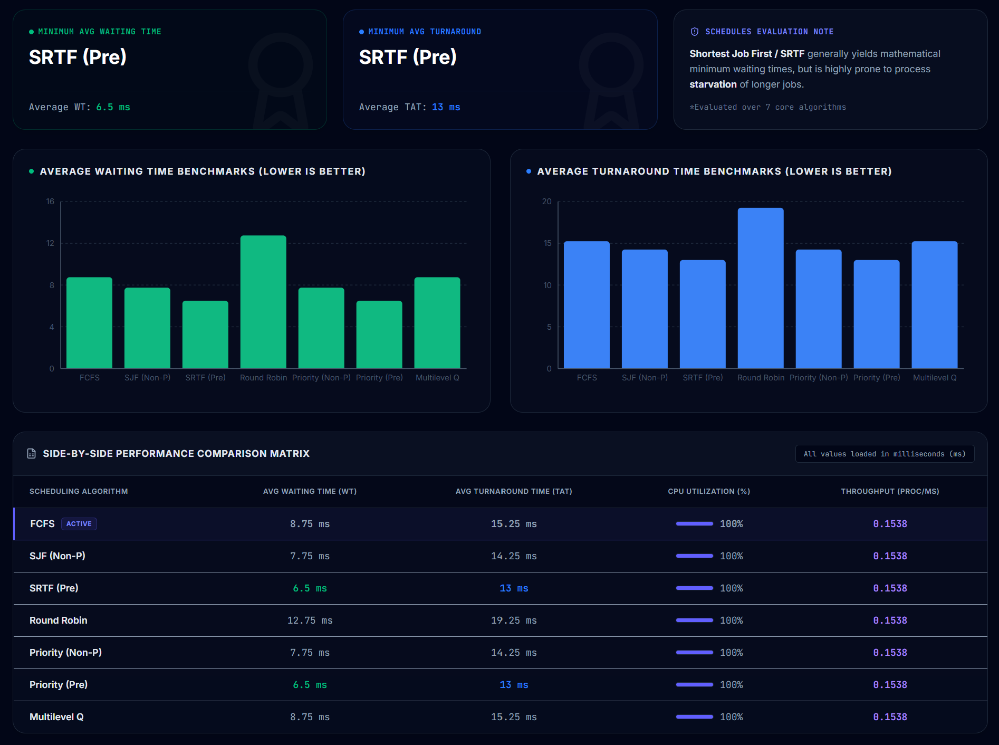
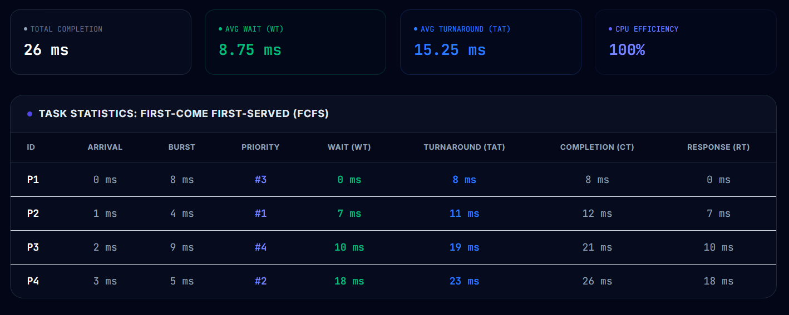
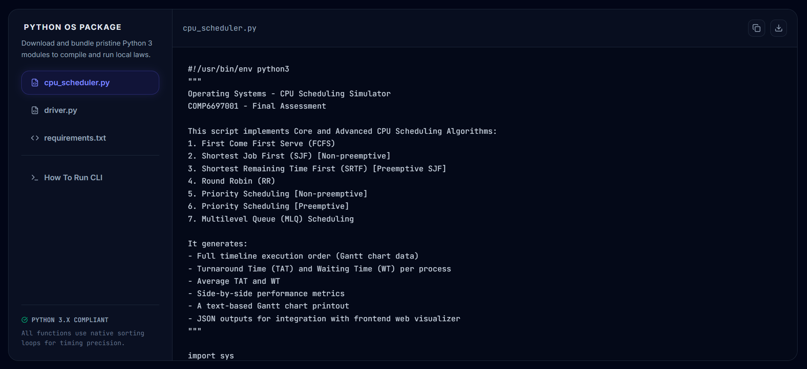

# PySchedule Simulator — CPU Scheduling Simulator

> **COMP6697001 — Operating Systems | Final Course Assessment**

> Binus International University

> Students: Michael Arianno Chandrarieta (2802499711) / Timothy Jonathan Imannuel (2802521825)

> Lecturer: Dr. Satrio Pradono Suryodiningrat

---

## Overview

**PySchedule Simulator** is an interactive, browser-based CPU scheduling simulator built for the Operating Systems course final project. It allows students and educators to visually design, run, and compare the behaviour of classic CPU scheduling algorithms in real time.

The application runs scheduling computations through a **Python backend engine** (`cpu_scheduler.py`) and seamlessly falls back to an **identical TypeScript implementation** if the Python runtime is unavailable — guaranteeing consistent, mathematically correct results in any environment.

### Demo Video Link

[Click This YouTube Link to Watch!](https://youtu.be/56n1PKvpZ_c)

---

## Screenshots

### Simulation Stage — Gantt Chart Visualizer





### Comparative Analytics Dashboard





### Python Source Viewer



---

### Algorithms Supported

| Algorithm | Type | Key Characteristic |
|---|---|---|
| First-Come First-Served (FCFS) | Non-preemptive | Arrival-order execution; prone to Convoy Effect |
| Shortest Job First (SJF) | Non-preemptive | Optimal average WT; requires burst prediction |
| Shortest Remaining Time First (SRTF) | Preemptive | Preempts on shorter arrival; optimal but complex |
| Round Robin (RR) | Preemptive | Fair time-sharing via configurable time quantum |
| Priority Scheduling (Non-Preemptive) | Non-preemptive | Highest priority runs when CPU is free |
| Priority Scheduling (Preemptive) | Preemptive | Immediately preempts on higher-priority arrival |
| Multilevel Queue (MLQ) | Preemptive | Two queues: High (RR q=2) and Low (FCFS); Q0 always preempts Q1 |

---

## Features

- **Interactive Simulation Stage** — Animated Gantt chart showing real-time CPU execution timeline per algorithm
- **Process Manager** — Add, edit, or remove processes with configurable arrival time, burst time, priority, and queue ID
- **Comparative Analytics Dashboard** — Side-by-side bar charts comparing Average Waiting Time and Turnaround Time across all algorithms
- **Python Source Viewer** — Browse the full annotated `cpu_scheduler.py` source code directly in the browser
- **Dual-Engine Architecture** — Python runtime (primary) with TypeScript fallback (automatic, transparent)
- **Per-process metrics** — Waiting Time, Turnaround Time, Completion Time, Response Time for each process

---

## Project Structure

```
PythonCPUSchedulingSim/
├── server.ts                  # Express backend — Python runner + Vite middleware
├── vite.config.ts             # Vite bundler configuration
├── tsconfig.json              # TypeScript configuration
├── package.json               # Node.js dependencies and scripts
│
├── src/
│   ├── main.tsx               # React entry point
│   ├── App.tsx                # Root component — tabs, simulation state, layout
│   ├── index.css              # Global styles
│   ├── types.ts               # Shared TypeScript types
│   ├── defaultData.ts         # Default process set loaded on startup
│   │
│   ├── components/
│   │   ├── ProcessManager.tsx       # Process table editor + algorithm controls
│   │   ├── LiveSimulation.tsx       # Animated Gantt chart + timeline visualizer
│   │   ├── PerformanceDashboard.tsx # Comparative multi-algorithm analytics
│   │   └── SourceViewer.tsx         # Python source code browser
│   │
│   ├── utils/
│   │   └── scheduler_engine.ts      # TypeScript fallback scheduler (mirrors Python logic)
│   │
│   └── python/
│       ├── cpu_scheduler.py         # Core Python scheduling engine (primary)
│       ├── driver.py                # Standalone Python test driver
│       └── requirements.txt         # Python dependencies
│
└── assets/                    # Static assets
```

---

## Dependencies

### Runtime — Node.js

| Package | Version | Purpose |
|---|---|---|
| `react` + `react-dom` | ^19.0.1 | UI framework |
| `express` | ^4.21.2 | Backend HTTP server |
| `vite` + `@vitejs/plugin-react` | ^6.2.3 / ^5.0.4 | Dev server & bundler |
| `tailwindcss` + `@tailwindcss/vite` | ^4.1.14 | Utility CSS framework |
| `lucide-react` | ^0.546.0 | Icon library |
| `recharts` | ^3.8.1 | Chart components (analytics dashboard) |
| `motion` | ^12.23.24 | Animation library |
| `dotenv` | ^17.2.3 | Environment variable loading |
| `tsx` | ^4.21.0 | TypeScript execution for server |
| `typescript` | ~5.8.2 | Type checking |

### Runtime — Python

| Package | Version | Purpose |
|---|---|---|
| `pandas` | >=2.0.0 | Data structures for scheduling output |
| `matplotlib` | >=3.7.0 | Optional chart generation in standalone mode |

> Python packages are only required for the primary Python engine. The app works fully without Python installed via the TypeScript fallback.

---

## How to Run

### Prerequisites

- **Node.js** v18 or higher — [nodejs.org](https://nodejs.org)
- **Python 3** *(optional but recommended)* — [python.org](https://python.org)

---

### 1. Install Node.js dependencies

```bash
npm install
```

### 2. Install Python dependencies *(optional)*

```bash
pip install -r src/python/requirements.txt
```

### 3. Start the development server

```bash
npm run dev
```

The app will be available at **[http://localhost:3000](http://localhost:3000)**.

The server will:

1. Attempt to run scheduling via the Python engine (`python3 src/python/cpu_scheduler.py`)
2. Automatically fall back to the TypeScript engine if Python is unavailable — results are identical

---

### Available Scripts

| Command | Description |
|---|---|
| `npm run dev` | Start the Express + Vite development server |
| `npm run build` | Build the production bundle (frontend + server) |
| `npm run start` | Run the compiled production server |
| `npm run lint` | Run TypeScript type checking |

---

### Standalone Python Mode *(optional)*

You can run the Python scheduler directly without the Node server:

```bash
python src/python/driver.py
```

This will execute all algorithms against a built-in test process set and print results to the terminal.

---

## How the Dual-Engine Works

```
Browser → POST /api/simulate-python
               ↓
         Express Server
               ↓
     Spawns python3 cpu_scheduler.py
               ↓
    ┌─────────────────────────────┐
    │ Python succeeds?            │
    │   YES → return Python JSON  │
    │   NO  → TSScheduler.runAll()│  ← mathematically identical
    └─────────────────────────────┘
               ↓
         React UI renders results
```

The indicator in the top-right nav bar shows which engine is active:

- 🟢 **Active Python Runtime Engine** — Python executed successfully
- 🟡 **TypeScript Fallback Emulation** — Python unavailable, TS engine used
